<!--

q()
cd /Users/davidbeauchesne/PhD/Acquisition_connaissance-Workshops/2019-03-13-Visualisation
R
for (i in list.files("./scripts", pattern="*\\.R$", full.names = TRUE)) {
  knitr::read_chunk(i)
}
slidify::slidify("./docs/viz.Rmd")

-->


<!-- Setting knitr  -->


<!-- Call our scripts -->


<!--


[X] - Hans Rosling
[ ] - Bases des graphiques
[ ]   - Élément graphiques
[ ]   - Tips
[ ] - Reproductibilité
[ ] - Easy graphs
[ ]   - Excel vs Sigmaplot vs R
[ ] - Cartographie
[ ]   - ArcGIS/QGIS vs R
[ ] - Complex layouts
[ ] - Exporting
[ ] - ggplot
[ ] - graph dynamique: mapview
[ ] - Visualisation interactive (shiny)
[ ] - Ressources de données en ligne
[ ] - Outils

-->

<!-- ################################################################################ -->

## Atelier

- Aspects techniques de la visualisation scientifique
- Survol des possibilités
- Melting pot de formations plus spécifiques
  - [Graph in R](http://kevcaz.github.io/QCBSgraphR/) by[ K. Cazelles](https://github.com/KevCaz) & [N. Casajus](https://github.com/ahasverus)
  - [VisualiseR](https://insileco.github.io/VisualiseR/) by [inSileco](https://insileco.github.io/), in construction
  - [R in Space](https://insileco.github.io/tags/r-in-space/) by [inSileco](https://insileco.github.io/)

<!-- ################################################################################ -->

--- .andy

## L'importance des graphiques

<q><b>"Une image vaut mille mots"</b></q>


- Résumé visuel de données et de résultats
- Plus efficace que des tables et du texte (parfois, pas toujours!)
- <b>Expoloration</b> de données
  - Tendances, corrélations, cycles, données extrêmes, etc
- Essentiel pour présenter des résultats

<br/>


<!-- ################################################################################ -->

---

<iframe width="948" height="533" src="https://www.youtube.com/embed/jbkSRLYSojo" frameborder="0" allow="accelerometer; autoplay; encrypted-media; gyroscope; picture-in-picture" allowfullscreen>
</iframe>

<!-- ################################################################################ -->

--- .transition

## La base des graphiques


<!-- ################################################################################ -->

---

## Choix graphique

<b>"Règles" de base</b>:

- Choisir le bon type de visualisation  (!!!)
- Selon les données et la question posée
- Outils utile pour sélection type de visualisation
  - Data vizualisation project - https://datavizproject.com/

<q><b>Les options les plus simples sont parfois les meilleures</b></q>

<!-- ################################################################################ -->

---

## Éléments graphique

<br/>

<q><b>Chaque élément graphique doit aider à comprendre les données</b></q>

<q><b>Un graphique doit être autosuffisant</b></q>

<!-- ################################################################################ -->

---&twocol w1:40% w2:60%

## Éléments graphique

*** =left

*** =right


<!-- ################################################################################ -->

---&twocol w1:40% w2:60%

## Éléments graphique

*** =left

- Zone graphique

*** =right

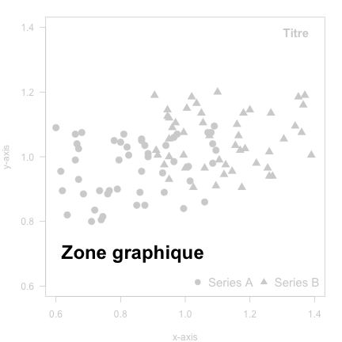

<!-- ################################################################################ -->

---&twocol w1:40% w2:60%

## Éléments graphique

*** =left

- Zone graphique
- Zone de représentation des données

*** =right

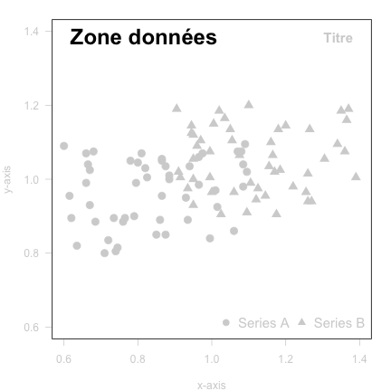

<!-- ################################################################################ -->

---&twocol w1:40% w2:60%

## Éléments graphique

*** =left

- Zone graphique
- Zone de représentation des données
- Représentation des données


*** =right

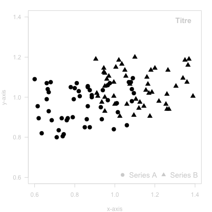

<!-- ################################################################################ -->

---&twocol w1:40% w2:60%

## Éléments graphique

*** =left

- Zone graphique
- Zone de représentation des données
- Représentation des données
- Axe


*** =right

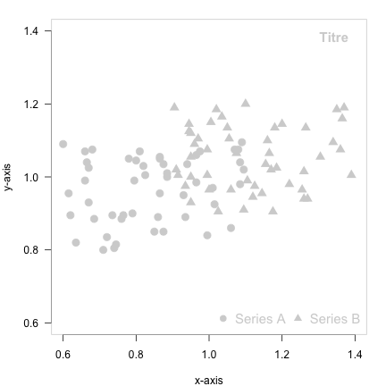

<!-- ################################################################################ -->

---&twocol w1:40% w2:60%

## Éléments graphique

*** =left

- Zone graphique
- Zone de représentation des données
- Représentation des données
- Axe
- Titre


*** =right

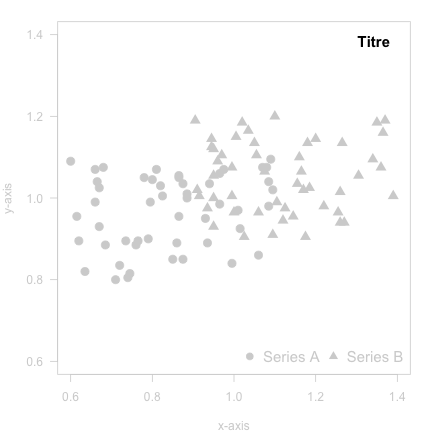

<!-- ################################################################################ -->

---&twocol w1:40% w2:60%

## Éléments graphique

*** =left

- Zone graphique
- Zone de représentation des données
- Représentation des données
- Axe
- Titre
- Légende

*** =right

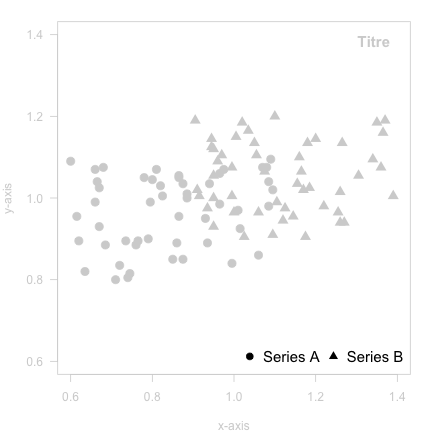

<!-- ################################################################################ -->

---&twocol w1:40% w2:60%

## Éléments graphique

*** =left

- Zone graphique
- Zone de représentation des données
- Représentation des données
- Axe
- Titre
- Légende

<b>Aussi vrai pour une carte géographique</b>

*** =right

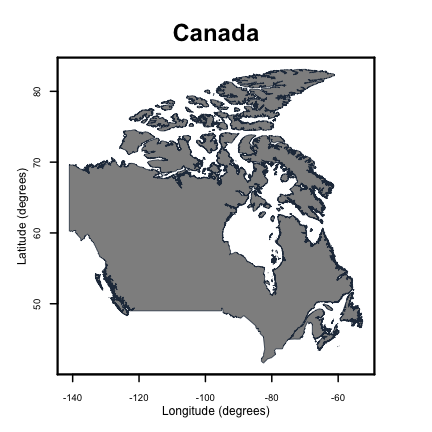

<!-- ################################################################################ -->

---&twocol w1:40% w2:60%

## Recommandations graphique

*** =left

- Éviter pie charts et les graphs 3D


*** =right
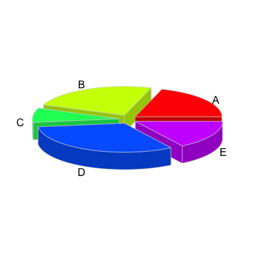

<!-- ################################################################################ -->

---&twocol w1:40% w2:60%

## Recommandations graphique

*** =left

- Éviter *pie charts* et les graphs 3D


*** =right


<!-- ################################################################################ -->

---&twocol w1:40% w2:60%

## Recommandations graphique

*** =left

- Éviter *pie charts* et les graphs 3D
- Uniformiser les couleurs
- Limiter le nombre de couleurs
- Utiliser la taille des points et <br/>
  des symboles

*** =right
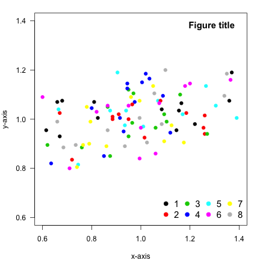

<!-- ################################################################################ -->

---&twocol w1:40% w2:60%

## Recommandations graphique

*** =left

- Éviter *pie charts* et les graphs 3D
- Uniformiser les couleurs
- Limiter le nombre de couleurs
- Utiliser la taille des points et <br/>
  des symboles


*** =right


<!-- ################################################################################ -->

---&twocol w1:40% w2:60%

## Recommandations graphique

*** =left

- Éviter *pie charts* et les graphs 3D
- Uniformiser les couleurs
- Limiter le nombre de couleurs
- Utiliser la taille des points et <br/>
  des symboles
- Éviter les éléments graphiques <br/>
  inutiles (*chart junk*)
  - Data-ink ratio (Tufte 1983)

*** =right
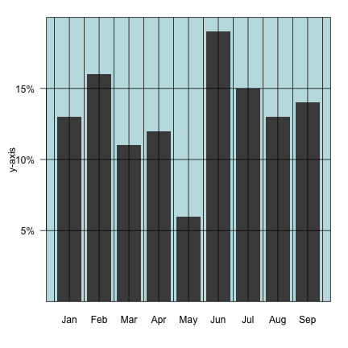


<!-- ################################################################################ -->

---&twocol w1:40% w2:60%

## Recommandations graphique

*** =left

- Éviter *pie charts* et les graphs 3D
- Uniformiser les couleurs
- Limiter le nombre de couleurs
- Utiliser la taille des points et <br/>
  des symboles
- Éviter les éléments graphiques <br/>
  inutiles (*chart junk*)
  - Data-ink ratio (Tufte 1983)

*** =right
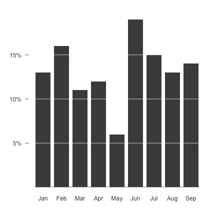


<!-- ################################################################################ -->

--- .transition

## Construction graphique

<!-- ################################################################################ -->

---

## Outils

- Excel
- SigmaPlot
- Photoshop
- Python
- R
- etc

<!-- ################################################################################ -->

--- .transition

## Reproductibilité


<!-- ################################################################################ -->

---&twocol w1:40% w2:60%

## Reproductibilité

*** =left

- Reproductibilité scientifique
- Données modifiées
- Résultats ajustés
- Requête(sss) de superviseurs!


<!-- ################################################################################ -->

---&twocol w1:40% w2:60%

## Reproductibilité

*** =left

- Reproductibilité scientifique
- Données modifiées
- Résultats ajustés
- Requête(sss) de superviseurs!


<br/>

<b>Utiliser du code pour produire des figures</b>


```r
x <- rnorm(100, 3, 1)
plot(x, pch = 20,
     cex = abs(x),
     col = '#41414177')
```

*** =right

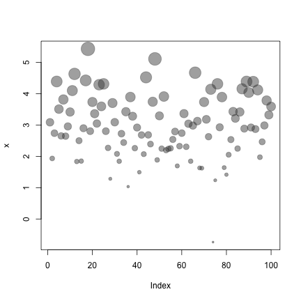


<!-- ################################################################################ -->

--- &slide

## R


- Logiciel de graphisme et de statistique
- Open-source, gratuit et multi-platforme
- Largement utilisé par la communauté scientifique
- Language de programmation
- Implémentation du language de programmation S
- Système développé par des package créés par les utilisateurs

<div class='centered'>  </div>

<!-- ################################################################################ -->

---
## R

  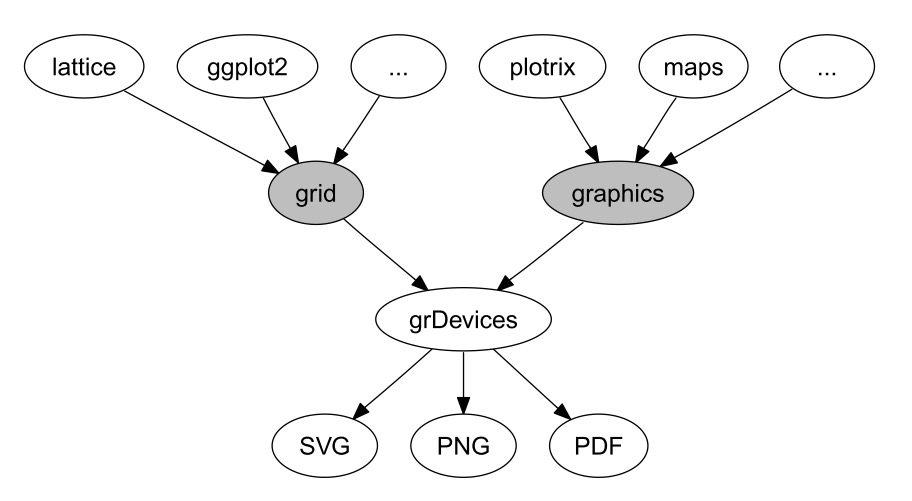
  <div class='centered'>Murrell, P. (2015) <a href="https://journal.r-project.org/archive/2015-1/murrell.pdf">The gridGraphics Package</a>. The R Jounal.</div>

<!-- ################################################################################ -->

---

## Packages graphiques

- Plus de 100 packages graphiques
- Pour une revue: [R task view](https://cran.r-project.org/web/views/Graphics.html)
- Pour une autre liste exhaustive: [inSileco list of packages to create and edit plots](https://insileco.github.io/wiki/rgraphpkgs/)

<!-- Faudrait dire que c'est un des coûts d'avoir autant de facilité... -->

<!-- ################################################################################ -->

--- &twocol w1:40% w2:60%

## Packages graphiques - graphics

*** =left
- Package de base
- Contient la fameuse fonction `plot()`
- Autre fonctions très utilisées:
  - `boxplot()`, `barplot()`, `hist()`
  - `lines()`, `points()`, `legend()`
  - etc.


```r
plot(x, y, ...)
points(x, y, ...)
title(main, ...)
legend(legend, ...)
```

*** =right


<!-- ################################################################################ -->

---

## Packages graphiques - graphics

<q> Vous n'avez besoin de connaître qu'une seule fonction: `plot()`</q>

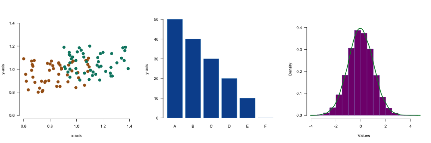

<!-- ################################################################################ -->

--- &twocol w1:40% w2:60%

## Packages graphiques - graphics

*** =left
<b>Esthétique à améliorer</b>


```r
tab <- read.delim('../data/iris.txt')
plot(tab$petal.l ~ tab$petal.w)
```

*** =right

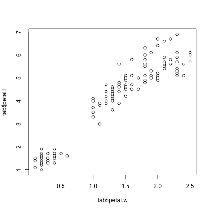

<!-- ################################################################################ -->

--- &twocol w1:40% w2:60%

## Packages graphiques - graphics

*** =left
<b>Décomposition graphique</b>
- Ajout d'éléments succésivement au <br/>
  graphique
- Grande flexibilité
- Peu de fonctions
- Beaucoup de travail


<!-- ################################################################################ -->

--- &twocol w1:40% w2:60%

## Packages graphiques - graphics

*** =left


```r
# Empty plot
plot(0,
     xlim = c(0, 8),
     ylim = c(0, 3),
     ann = FALSE,
     axes = FALSE,
     type = 'n')
```

*** =right


<!-- ################################################################################ -->

--- &twocol w1:40% w2:60%

## Packages graphiques - graphics

*** =left


```r
## Grid
abline(v = c(2, 4, 6),
       col = '#868484',
       lty = 3)
abline(h = c(1, 2),
       col = '#868484',
       lty = 3)
```

*** =right

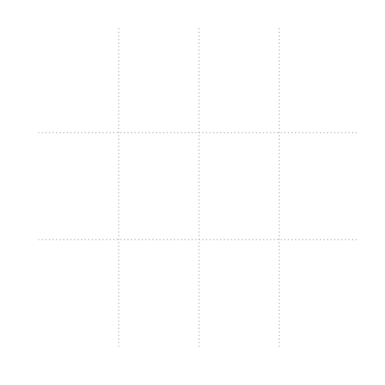

<!-- ################################################################################ -->

--- &twocol w1:40% w2:60%

## Packages graphiques - graphics

*** =left


```r
## Axes
## x-axis
axis(side = 1,
     at = seq(0, 8, by = 2),
     labels = seq(0, 8, by = 2))
mtext(text = 'Petal length (in cm)',
      side = 1,
      line = 1.75)

## y-axis
axis(side = 2,
     at = seq(0, 3, by = 1),
     labels = seq(0, 3, by = 1),
     las = 1)
mtext(text = 'Petal width (in cm)',
      side = 2,
      line = 1.75)
```

*** =right

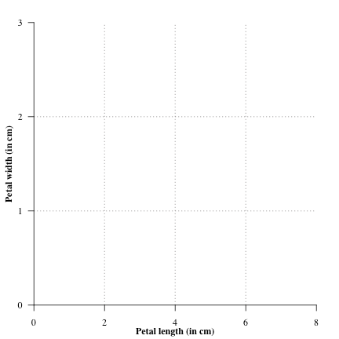

<!-- ################################################################################ -->

--- &twocol w1:40% w2:60%

## Packages graphiques - graphics

*** =left


```r
## Parameters
spp  <- c('versicolor','virginica','setosa')
col1 <- c('#505050','#4e7bdb','#8b0000')
col2 <- paste0(col1, '88')

## Add points per species
for (i in 1 : length(spp)){
rat <- tab[tab$species == spp[i], ]
points(rat[ , c('petal.l', 'petal.w')],
       col = col2[i],
       bg = col2[i],
       cex = rat[ , 'n']/1.25,
       pch = 21)
}
```

*** =right

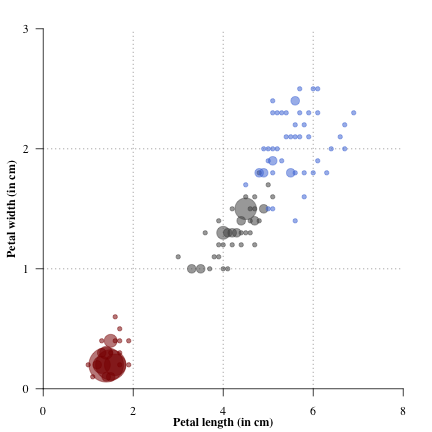

<!-- ################################################################################ -->

--- &twocol w1:40% w2:60%

## Packages graphiques - graphics

*** =left

```r
## Linear regression
for (i in 1 : length(spp)){
rat <- tab[tab$species == spp[i], ]
petal.l <- data.frame(
               seq(min(rat$petal.l),
               max(rat$petal.l),
               by = 0.05))
mod <- lm(petal.w ~ petal.l, data = rat)
ypred <- predict(object = mod,
                 newdata = petal.l,
                 se.fit = TRUE)
lines(x = newrat$petal.l, y = ypred$fit,
      col = col1[i], lwd = 2)
lines(x = newrat$petal.l,
      y = ypred$fit + ypred$se.fit,
      col = col1[i], lwd = 1, lty = 2)
lines(x = newrat$petal.l,
      y = ypred$fit - ypred$se.fit,
      col = col1[i], lwd = 1, lty = 2)
}
```

*** =right

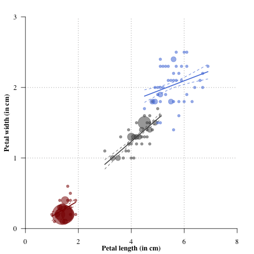

<!-- ################################################################################ -->

--- &twocol w1:40% w2:60%

## Packages graphiques - graphics

*** =left

```r
## Add legend
legend('topleft',
       lwd = 3,
       col = col1,
       legend = paste('I.', spp),
       bty = 'n')
```

*** =right

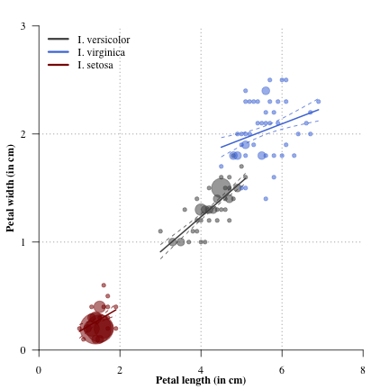

<!-- ################################################################################ -->

--- &twocol w1:40% w2:60%

## Packages graphiques - ggplot2

*** =left
- Un système de graphisme complet
- Basé sur la grammaire des graphiques
- Très populaire
- Utilise sa propre syntaxe...
- qui peut être difficile à apprendre


```r
library(ggplot2)
p <- ggplot(data = dat,
            aes(x = x, y = y, colour = z)) +
     geom_point(size = 3)
p
```

*** =right
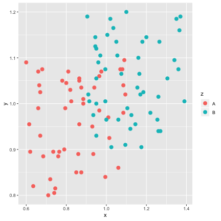

<!-- ################################################################################ -->

--- &twocol w1:40% w2:60%

## Packages graphiques - ggplot2

*** =left
- Un système de graphisme complet
- Basé sur la grammaire des graphiques
- Très populaire
- Utilise sa propre syntaxe...
- qui peut être difficile à apprendre


```r
library(ggplot2)
p <- ggplot(data = dat,
            aes(x = x, y = y, colour = z)) +
     geom_point(size = 3) +
     facet_wrap(~z)
p
```

*** =right
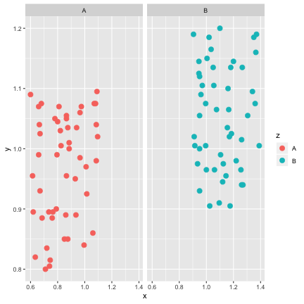

<!-- ################################################################################ -->

--- &twocol w1:40% w2:60%

## Packages graphiques - ggplot2

*** =left
- Un système de graphisme complet
- Basé sur la grammaire des graphiques
- Très populaire
- Utilise sa propre syntaxe...
- qui peut être difficile à apprendre


```r
library(ggplot2)
p <- ggplot(data = dat,
            aes(x = x, y = y, colour = z)) +
     geom_point(size = 3) +
     facet_wrap(~z) +
     theme_dark()
p
```

*** =right
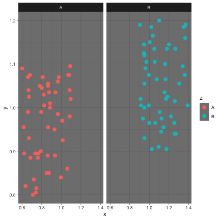

<!-- ################################################################################ -->

--- .transition

## Analyses spatiale et cartographie


<!-- ################################################################################ -->

---

## Outils

- ArcGIS
- QGIS
- Python
- R
- etc

<!-- ################################################################################ -->

--- .transition

## Reproductibilité (encore une fois!)

<!-- ################################################################################ -->

--- &twocol w1:40% w2:60%

## Reproductibilité

*** =left

```r
library(raster)
load('./predSP.RData')
ext <- extent(predSP) # Spatial extent
par(mfrow = c(11,12), mar = c(0,0,0,0))
for(i in 1:124) {
plot(0, xlim = ext[1:2], ylim = ext[3:4],
     axes = FALSE, ann = FALSE, type = 'n')
plot(predSP[[i]], legend = FALSE, add = T)
}
```

*** =right

<figure>
  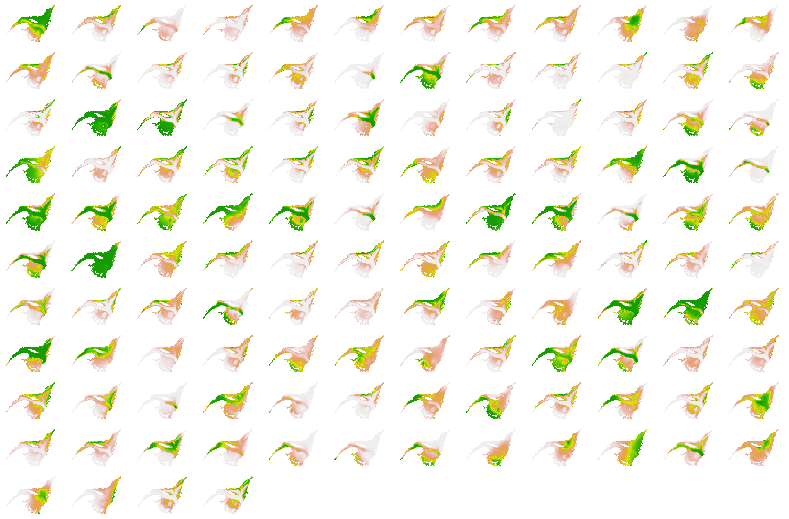
</figure>

<!-- ################################################################################ -->

---

## Analyses spatiales et catrographie sous R

- Série de packages permettant les analyses spatiales <br/>
  et la cartographie sous R
  - `sf`, `raster`, `mapview`, `rgdal`, `rgeos`, ...
- Opérations sur raster et vecteurs
- Efficacité d'analyse
- Production de carte géographique
- Outils graphiques intégrés
  - `graphics`
  - `ggplot2`

<!-- ################################################################################ -->

---

## Ressources spatiales et cartographiques

- Plusieurs packages permettent d'accéder à des ressources <br/>
  spatiales et cartographiques en utilisant R
  données spatiales en utilisant R
- Données abiotiques: `marmap`, `raster`, `rnoaa`, `sdmpredictors`
- Données biotiques: `rgbif`, `robis`, `spocc`
- Base maps: `ggmap`, `mregions`, `osmdata`, `raster`, `rnaturalearth`

<!-- ################################################################################ -->

--- &twocol w1:40% w2:60%

## Ressources spatiales et cartographiques

*** =left

```r
canada <- getData('GADM',
                  country="CAN",
                  level=1)
plot(canada)
```

*** =right
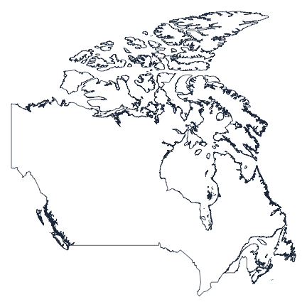

<!-- ################################################################################ -->

---

<figure>
  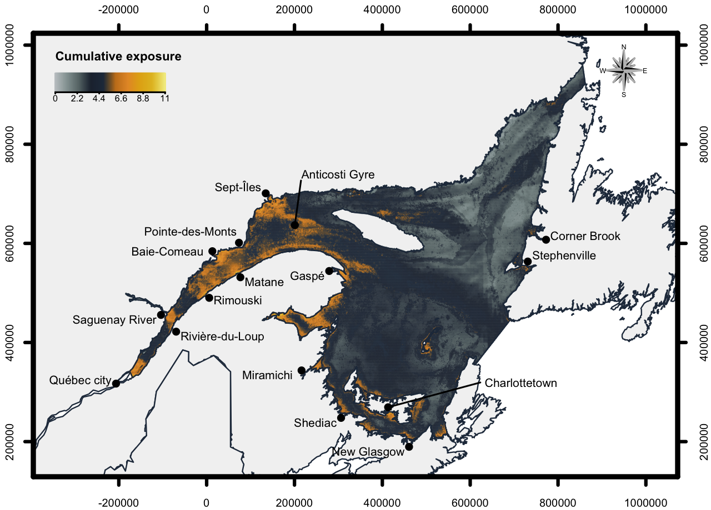
</figure>

<!-- ################################################################################ -->

---

<figure>
  
</figure>

<!-- ################################################################################ -->

--- .transition

## Partitionnement et composition

<!-- ################################################################################ -->

---

## Partitionnement et composition

<b>Construction de graphiques complexes</b>

- Partitionnement du périphérique graphique afin <br/>
  d'y inclure plusieurs graphes
- Construction de graphiques superposés
- Mise en page complexe

<!-- ################################################################################ -->

--- &twocol w1:40% w2:60%

## Partitionnement et composition

*** =left

<b>Partitionnement de base</b>

- Argument `mfrow` dans `par()`


```r
par(mfrow = c(2, 2))
plot(rnorm(30), col = "red", main = "1")
box("figure")
plot(rnorm(30), col = "blue", main = "2")
box("figure")
plot(rnorm(30), col = "green", main = "3")
box("figure")
plot(rnorm(30), col = "black", main = "4")
box("figure")
```

*** =right
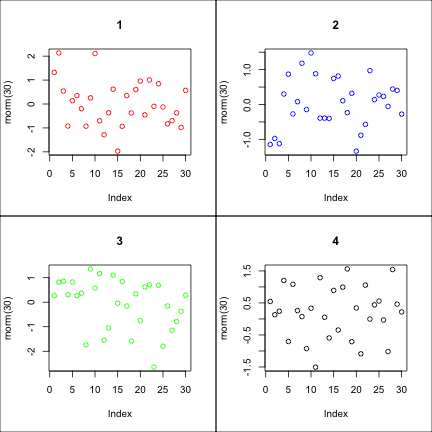

<!-- ################################################################################ -->

--- &twocol w1:40% w2:60%

## Partitionnement et composition

*** =left

<b>Partitionnement avancé</b>

- `layout()`


```r
layout(matrix(c(1,2,4,1,3,4),nrow=3))
plot(rnorm(30), col = "red", main = "1")
plot(rnorm(30), col = "blue", main = "2")
plot(rnorm(30), col = "green", main = "3")
plot(rnorm(30), col = "black", main = "4")
```

*** =right
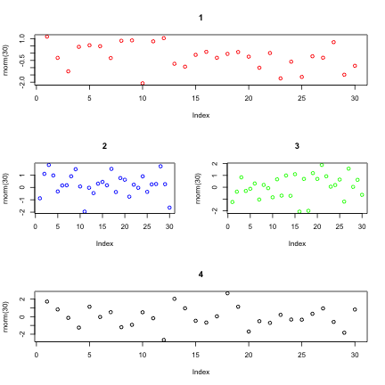

<!-- ################################################################################ -->

--- &twocol w1:40% w2:60%

## Partitionnement et composition

*** =left

<b>Partitionnement avancé</b>

- `layout()`


```r
layout(matrix(c(1,2,4,1,3,4), nrow=3),
       widths = c(1, 2),
       heights = c(1, 2, 1))
plot(rnorm(30), col = "red", main = "1")
plot(rnorm(30), col = "blue", main = "2")
plot(rnorm(30), col = "green", main = "3")
plot(rnorm(30), col = "black", main = "4")
```

*** =right
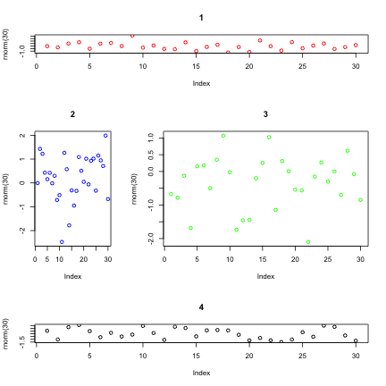

<!-- ################################################################################ -->

--- &twocol w1:40% w2:60%

## Partitionnement et composition

*** =left
<br/><br/>
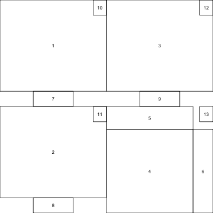

*** =right

<figure>
  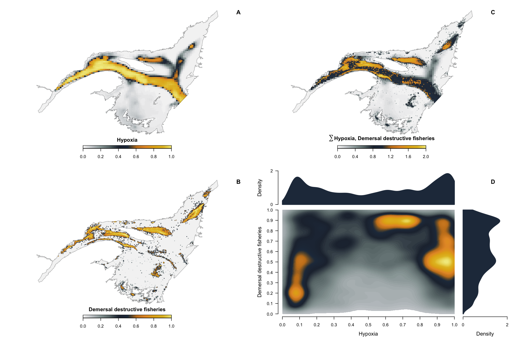
</figure>

<!-- ################################################################################ -->

---

<br/>

<figure>
  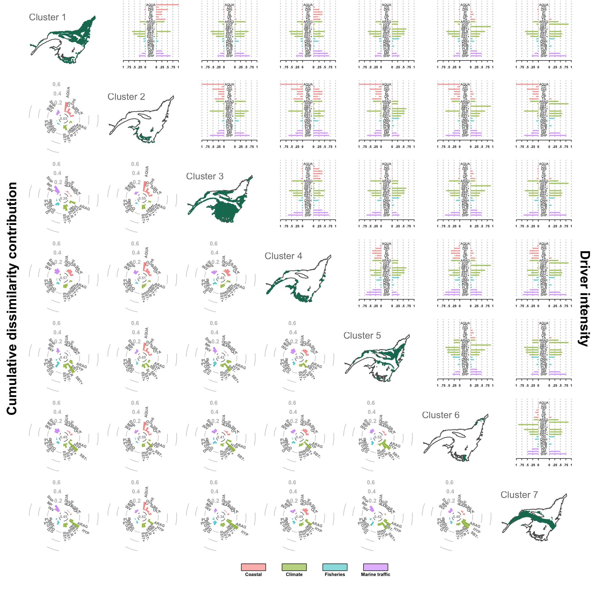
</figure>


<!-- ################################################################################ -->

--- &twocol w1:40% w2:60%

## Partitionnement et composition

*** =left

<b>Graphiques superposés</b>

- Argument `new` dans `par()`


```r
x <- seq(50, 1500, by = 50)
y1 <- sample(100:2000, size = 30)
y2 <- sort(y1)/100
y1 <- sort(y1, decreasing = T)
## Premier graphe
plot(x, y1, type = "h", lwd = 5, axes = F,
     ylim = c(0, 2000), xlim = c(0, 1550))
axis(1); axis(2)
## Second graphe
par(new = TRUE)
plot(x, y2, type = "l", col = "red", lwd = 2,
     ann = F, ylim = c(0, 30), axes = F,
     xlim = c(0, 1550))
axis(4, col.axis = 'red')
```

*** =right
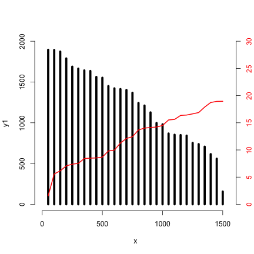

<!-- ################################################################################ -->

--- &twocol w1:40% w2:60%

## Partitionnement et composition

*** =left

<b>Graphiques imbriqués</b> (médaillon)

- Arguments `new`, `fig` dans `par()`


```r
x <- seq(50, 1500, by = 50)
y1 <- sample(100:2000, size = 30)
y2 <- sort(y1)/100
y1 <- sort(y1, decreasing = T)
## Premier graphe
plot(x, y1, type = "h", lwd = 5, axes = F,
     ylim = c(0, 2000), xlim = c(0, 1550))
axis(1); axis(2)
## Second graphe
par(new = TRUE)
par(fig = c(.6,.9,.6,.9), mar = c(0,0,2,2))
plot(x, y2, type = "l", col = "red", lwd = 2,
     ann = F, ylim = c(0, 30), axes = F,
     xlim = c(0, 1550))
axis(1); axis(2); axis(3); axis(4)
```

*** =right
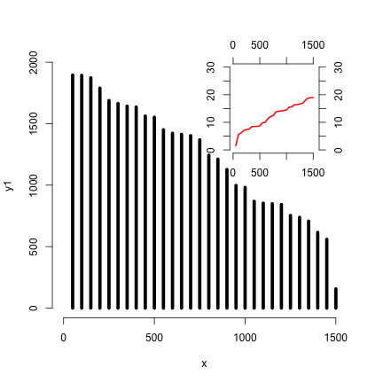

<!-- ################################################################################ -->

--- .transition

## Visualisation interactive

<!-- ################################################################################ -->

---

## Visualisation interactive

- Graphique avec lequel on peut interagir:
  - Modifier axes
  - Zoom
  - Pointer
  - etc
- Basé sur le language html: `htmltools`, `htmlwidgets`
- Plusieurs packages disponible:
  - https://www.htmlwidgets.org/
  - `leaflet`, `plotly`, `networkD3`, ...

<!-- ################################################################################ -->

---

<iframe width="100%" height="100%"
src="https://www.htmlwidgets.org/showcase_leaflet.html">
</iframe>

<!-- ################################################################################ -->

---

<section class = "slide coder"><div>
<iframe width="100%" height="100%"
src="https://plot.ly/r/dashboard/">
</iframe>
</div></section>

<!-- ################################################################################ -->

---

<iframe width="100%" height="100%"
src="https://insileco.github.io/fr-departement-election/">
</iframe>


<!-- ################################################################################ -->

---

<iframe width="100%" height="100%"
src="https://qcbs.ca/dashboard/pages/index.php?graph=collaboration_edge&lang=fr">
</iframe>


<!-- ################################################################################ -->

--- .transition

## Applications interactives

<!-- ################################################################################ -->

---

## Applications interactive

- Construction d'applications web interactives
- Package `shiny`: https://shiny.rstudio.com/
- Serveur réactif R + interface utilisateur
- Toutes les capacités de R accessibles
- Peut être simple...
- mais aussi complexe
  - html5, css, javascript


<!-- ################################################################################ -->

---

<iframe width="100%" height="100%"
src="https://shiny.rstudio.com/gallery/kmeans-example.html">
</iframe>

<!-- ################################################################################ -->

---

<iframe width="100%" height="100%"
src="https://shiny.rstudio.com/gallery/retirement-simulation.html">
</iframe>

<!-- ################################################################################ -->

---

<iframe width="100%" height="100%"
src="https://ahasverus.shinyapps.io/bioclimaticatlas/">
</iframe>


<!-- ################################################################################ -->

--- .transition

## Ressources

<!-- ################################################################################ -->

---

## Ressources

- GitHub: [https://github.com/](https://github.com/)
- StackOverflow: [https://stackoverflow.com/](https://stackoverflow.com/)
- ROpenSci: [https://ropensci.org/](https://ropensci.org/)
- inSileco: [https://stackoverflow.com/](https://stackoverflow.com/)
- Data vizualisation project: [https://datavizproject.com/](https://datavizproject.com/)
- Liste de ressources pour R: [https://insileco.github.io/wiki/rgraphpkgs/](https://insileco.github.io/wiki/rgraphpkgs/)
- Livre en construction: [https://github.com/inSileco/VisualiseR](https://github.com/inSileco/VisualiseR)

<!-- ################################################################################ -->

--- .transition

## C'est fini!
